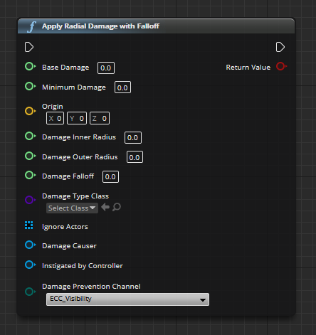
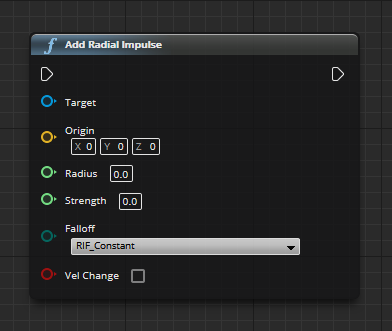
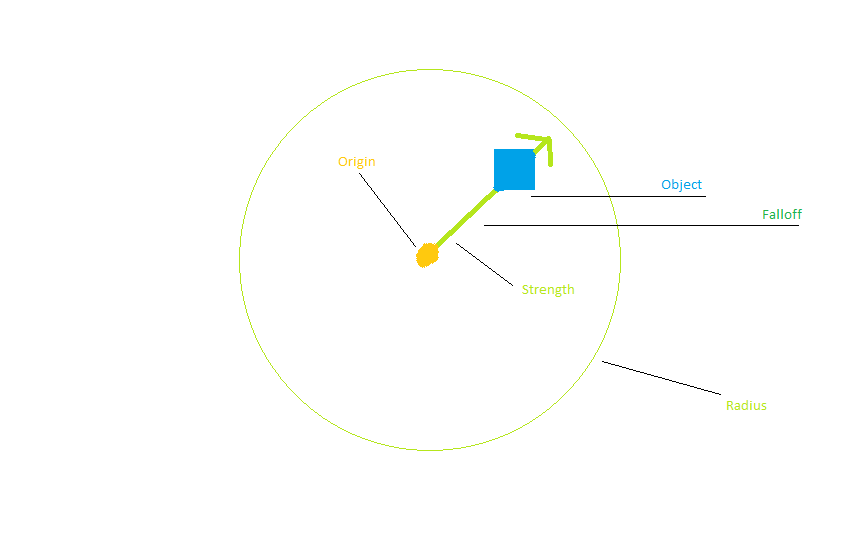
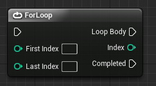

# Projektseite
[Zurück zur Hauptseite](https://github.com/Felixzed/Informatikprojekt)

Notiz:

Projektseite beschreibt die Funktionsweise des Programms, hier nicht auf den Prozess des programmierens hinweisen, nur funktionsweise erklären.

# Einführung:

Hallo! Hier finden sie meine erklärung der Funktionsweisen meines Spiels, zum Anfangen habe ich ein Preset von Unreal Engine verwendet namens "FPPpreset" welches Bewegungsfunktionalität und First-Person frameworks bereitstellt, dieses habe ich viel bearbeitet und habe auch vieles neue hinzugefügt um meinen Spiel-Prototyp zu erstellen.

Gescriptet ist alles in "Blueprint", eine visuelle Programmiersprache die mit sog. "Pins" arbeitet um Informationsübertragung darzustellen. Ich habe wenig Erfahrung in 3D-Modellierung, welches bei selbst den besten sehr zeitaufwändig ist. Deswegen habe ich aus dem Internet heruntergeladene Assets verwendet, eine Liste von diesen und die dazugehörigen links finden sie am untersten Ende dieses Textes.

## Glossar:

Actor: Jede Form von Objekt das ein Teil des Spielgeschehens ist. (Z.b. Spielercharakter, Wand, Kiste, Sound-Emitter, Schalter)

Pin: Ein In- und Output für Daten bei dem Programmieren mit Blueprints, z.B. ein Vektor, Array oder eine Objektreferenz.

Mesh: Das 3D-Form eines Actors ohne Textur. Z.B. ein Mensch, ein Stuhl, ein Tisch, eine Flasche oder eine Wand.
## Einführung Ausführungsreihenfolge:

Execution-Pins sind eine Visuelle Darstellung vom Scriptverlauf, jede Funktion wie z.B. "Launch Character" in Unreal Engine hat einen Execution-Pin Ein- und Ausgang. Blueprint-Scripte starten immer mit einem festen Start-Block der verschiedene Events im Spielverlauf darstellt (OnHit, OnReceiveDamage), diese Start-Blöcke haben nur einen Execution-Output womit normalerweise das Script eines Actors ausgelöst wird. Events können auch selber erstellt werden, allerdings wird diese Funktionalität in dem Spiel nicht verwendet.

Hiervon gibt es noch eine sonderform, sogenannte "Construction Scripts" hier gibt es einen Start-Block der sich "OnConstruction" nennt, construction scripts führen sich aus sobald ein Objekt in einem level gespawnt wird (Construction - Aufbau, das Script wird sozusagen bei dem "Aufbau" eines Actors ausgelöst) diese sind nützlich um z.B. Actor anzugeben, die sich selbst nach einer gewissen Zeit wieder löschen sollen.

Oft werden zwecks übersichtlichkeit teile des Scripts in "Functions" aufgeteilt. Praktisch ist auch an diesen "Functions" (Von hier an "Funktionen" genannt) dass diese bei der Ausführung ein Event generieren. Wenn ich eine Funktion namens "ShootProjectile" habe, gibt es dazu direkt ein event das "Event ShootProjectile" heißt.

# Waffen-/Spielerfunktionalität Erklärt

## Funktion:
Unser Spieler hat um sich gegen die Zombies zu wehren einen Granatenwerfer, dieser kann er mit Hilfe der linken Maustaste schießen.
Der Granatwerfer hat eine 6-Schuss Trommel und muss, wenn er leer ist, mit dem drücken der "r"-Taste nachgeladen werden. Hierfür greift er auf eine Munitionsreserve von max. 12 Granaten zu. Der Spieler kann, wenn seine Reserve leer ist, nicht mehr nachladen. Er ist zum Aufmunitionieren zwecks Munitionskiste gezwungen. Alle wichtigen Infos zu Munition (In der Waffe geladen/Vorrat) werden unten Rechts auf dem Bildschirm angezeigt.
Wenn ein Spieler eine Munitionskiste berührt wird seine Reservemunition vollkommen aufgefüllt.

Nun folgt eine Erklärung der wichtigen Funktionen rundum Bewegen, Schießen und Nachladen.

### Bewegung:

Die tasten W/S und D/A wurden jeweils einer sogenannten "Input-Axis" zugewiesen, W/S wurden "MoveX" zugewiesen und D/A "MoveY". Dabei steht W bei MoveX für 1 und S für -1, bei MoveY steht D für 1 und A für -1. Diese Werte werden in dem Blueprint des Spielercharakters einer "AddMovementInput"-Funktion zugewiesen, die dann diese Werte in Bewegungen umwandelt. 

### Schießen

Wenn der Spieler die linke Maustaste drückt, checkt das Script ob die Munition größer als 0 ist oder ob die Boolean "IsReloading" falsch ist. Wenn eines der beiden nicht der Fall ist passiert nichts, wenn allerdings beides der Fall ist wird ein Granaten-Actor mit einer festen Geschwindigkeit in die Richtung in die die Kamera zeigt geschossen.

## Granaten:

Wir beginnen mit on EventHit
Ein hit-event wird generiert, wenn ein Actor einen anderen Actor, mit dem er zusammenprallen kann, berührt.
Dieses hit-event löst einen execution-pin aus, womit der verlauf des Scripts beginnt.

### Apply Radial Damage with Falloff

Diese Funktion erlaubt es, in einem Radius um einen Aufschlagspunkt dinge zu "beschädigen"
UnrealEngine kommt mit einem bereits integrierten Schaden-Framework, es muss nur definiert werden, dass ein Actor auch beschädigt werden kann. 

Hierbei sind für uns Base Damage, Minimum Damage, Origin, Damage Inner Radius, Damage Outer Radius, Damage Falloff, Damage Causer und Instigated by Controller wichtig.

Base Damage beschreibt hier den Grundschaden den wir Machen wollen in unserem Radius, Minimum Damage den Minimalwert unter den Unser Schaden nicht niedriger fallen kann. Origin ist der Mittelpunkt von dem Radius und Damage Inner Radius beschreibt ab welchem Punkt in einem Radius wir vollen Schaden machen, diesen lasse ich bei "0". Damage Outer Radius beschreibt, ab wann wir den minimalschaden machen. Damage Falloff ist dann noch die Methode, die zwischen den Werten von Minimum Damage und Base Damage anhand von der Distanz zum Aufschlagspunkt und Outer Radius einen Schadenswert für einen Actor berechnet.

Apply Radial Damage braucht keine Angabe, welcher Actor beschädigt werden soll, lediglich welche Actor nicht beschädigt werden. 
Base Damage, Minimum Damage, Damage Inner Radius, Damage Outer Radius und damage Falloff sind konstanten, da diese nicht vom Spielgeschehen beeinflusst werden sollen. 
### Add Radial Impulse

AddRadialImpulse ist die Funktion, die unserem Granatwerfer erlaubt nach dem Aufschlagen PhysicsActor wegzustoßen.

"Target" Beschreibt, welches Objekt den Impuls erfahren soll.
"Origin" ist der Punkt, von dem der Radius ausgeht.
Die "Radius" und "Strength" pins sind eine Float value und beschreiben jeweils die Größe des Radius und Stärke des Impulses. Außerhalb des Radius wirkt der Impuls nicht mehr. "Falloff" beschreibt dann ob die Funktion, die die abfallende Impulsstärke berechnet, exponentiell oder linear mit der Distanz vom Aufschlagspunkt abfällt. Und "Vel Change" diktiert, ob der Impuls die Masse des weggestoßenen Objektes ignorieren sollte.

Ein (Toll gezeichnetes) visuelles Beispiel:

Alle Actors, die von den Physikaktionen der Granaten betroffen werden sollen, sind manuell mit einem "PhysicsEnabled"-Tag gekennzeichnet. 

Zuerst wird der AddRadialImpulse zwecks ForLoop ein Array von allen Actors auf der Map die den Tag "PhysicsEnabled" besitzen gegeben.
ForLoop gibt von einem Array für jeden Eintrag einmal die präzisen Daten aus. Hiermit definieren wir im Grunde dass mehr als ein Actor von AddRadialImpulse betroffen sein soll, da AddRadialImpulse eine sogenannte "Primitive Object Reference" braucht, sprich die einfach Identifikationsdaten von einem Actor auf einer Karte.

AddRadialImpulse folgt bei dem ForLoop allerdings dem ablauf von "Loop Body", der für jeden eintrag in einem Array abgefeuert wird. Der weitere Scriptverlauf folgt "Completed". "Completed" schickt ein Signal, sobald alle Einträge in dem Array verarbeitet wurden. 

"Radius" und "Strength" ist definiert als eine Konstante. Es besteht keine Absicht, die Schadenswerte in irgendeiner Art während des Spielverlaufes zu ändern.

# Wellen- und Spawnstruktur

## Wellen-Spawning
In der Sog. "Game Mode Blueprint" wird die Wellenzahl und die Zombieanzahl sowohl als auch die Liste potentieller Spawnpunkte gespeichert und bearbeitet. Ebenfalls werden die UI-Elemente wie der Countdown zur nächsten Welle prozessiert.

### Zufällige Spawnpunkte
Jeder Actor mit dem Tag "ZombieSpawnPoint" liefert bei dem start des Spiels die Daten die die eigene Lage auf der Karte beschreiben in einen Array namens "SpawnList" welcher im Blueprint des Spielmodus gespeichert ist. Von diesem Array wird zufällig ein Eintrag ausgewählt jedes mal wenn ein Spawnzyklus ausgeführt wird und als Spawnort für den Zombie eingespeist. Folglich erhalten wir in Jedem Spawnzyklus zufällig gespawnte Zombies auf viele festen möglichen Spawnpunkten.

# Zombies, Schaden und KI.

## Zombies

## Funktionen
Zombies erscheinen je nach Wellenzahl in immer größeren Mengen, sie erscheinen in ihren korrospondierenden Mengen an zufälligen vordefinierten Punkten, sogenannten "ZombieSpawnPoints" und bewegen sich immer zum Spieler, auch wenn sie ihn nicht sehen können. Sobald sie nah genug an dem Spieler sind, werden sie versuchen ihn anzugreifen. Der Spieler kann Zombies mit seinem granatwerfer bekämpfen, sie sterben nachdem sie 100 Punkte Schaden erlitten haben. Wenn Zombies sterben können sie potentiell Munitionskisten droppen und werden zu ragdolls und später dann gelöscht.

## Schaden nehmen
Zombies erleiden Umgebungsschaden wenn eine Granate des Spielers in der nähe explodiert.

Diese ganze Funktion ist in eine Unterfunktion gefasst namens "ZombieDamageHandler"
Jeder Zombie hat für dieses System zwei wichtige Variablen. Einmal "MaxHealth" und "CurrentHealth".
MaxHealth ist konstant die Zahl 100, diese Konstante definiert die maximalanzahl an HP, die ein Zombie besitzen kann. CurrentHealth dagegen speichert, wie viel HP der Zombie im Moment hat.

Da der Spieler in dem Spiel nur Radial Damage austeilen kann, beginnt die Funktion ZombieDamageHandler mit einem Event On Take Radial Damage.
CurrentHealth wird abgefragt und wird von dem erlittenen Schaden subtrahiert, danach wird der wert für CurrentHealth aktualisiert. Darauffolgend wird 
ein Boolean anhängig von dem wert von CurrentHealth generiert, je nachdem ob CurrentHealth kleiner/gleich 0 ist. Wenn CurrentHealth größer 0 dann geschieht nach dem Schaden nehmen nichts, wenn CurrentHealth größer/gleich 0 ist, dann geschieht der "Ragdolling" Prozess.

### Ragdolling
Ragdolling ist ein feature, welches die Meshes unserer Zombies nach ihrem tod ähnlich wie eine Stoffpuppe mit simulierter Physik zusammenfallen lässt. (Rag doll = Stoffpuppe)
Dies geschieht ähnlich wie bei normalen PhysicsActors. Die Zombie meshes werden, sobald ihr übergeordneter actor unter 100 Health fällt, mit dem Tag "PhysicsEnabled" versehen. Die Physiksimulation wird dann für den Mesh aktiviert und die Sichtbarkeit und Kollision der Capsule Component deaktiviert, beide werden dann 5 Sekunden später gelöscht wird um speicher zu sparen.

## Zombie KI
Zombies haben kein komplexeres Verhalten als Bewegen und Angreifen, OnTick bekommt jeder Zombie den Befehl sich zu der Spielerposition zu bewegen, es wird ein Radius definiert in dem dieser Bewegungsbefehl erfolgreich ausgeführt wurde, also Sobald das Zielobjekt, in diesem Fall der Spieler, sich in einem Radius um den Zombie befindet wird ein "OnSuccess"-Pin ausgeführt. Wenn der Zombie das Zielobjekt nicht in diesem Radius findet wird ein "OnFailure"-Pin ausgeführt. OnSuccess und OnFailure setzen hierbei eine Boolean-Variable "IsAttacking" auf wahr oder falsch. IsAttacking wird zum steuern der Angriffsfunktionalität und Animation verwendet.

## Zombie-Nahkampfangriffe
Nach einem Gate welches unser Script nur ausführt wenn IsAttacking wahr ist, wird es in eine Verzögerung geleitet. Nach der Verzögerung wird geprüft, ob der Spieler sich mehr als 40 Unreal Engine Distanzeinheiten (1UE = 1cm) von dem Zombie entfernt hat, wenn er dies getan hat wird der Angriff zwecks Branch mit Boolean abgebrochen. Wenn er dies nicht getan hat wird Schaden ausgeteilt. Dies erlaubt dem Spieler von dem Angriff des Zombies wegzulaufen bevor er davon getroffen wird, obwohl er sich vorher schon im Angriffsradius befand.

## Munition droppen
Jeder Zombie hat eine Feste Chance eine Munitionskiste zu droppen. Diese Munitionskisten sind Physikobjekte. Wenn der Spieler in eine Munitionskiste läuft verschwindet diese und die Reservemunition des Spielers wird wieder aufgefüllt. Ausgelöst wird diese Funktion mit einem OnBeginOverlap-Event. Die Drop-Chance wird berechnet durch die auswahl einer zufälligen Integer im Bereich von 1 bis 0, es wird geprüft ob diese Zufällige Zahl kleiner/gleich die variable "AmmoCrateDropChance" (AmmoCrateDropChance normalerweise = 0.2) ist. Wenn dies der fall ist wird eine Munitionskiste auf der Position des Zombies gedroppt.

# Animationen u. Effekte.

## Animation von Spieler, Zombies. 
Sowohl der Spieler als auch die Zombies besitzen eine sogenannte "Animation-Blueprint". Diese erlaubt es den Zombies und dem Spieler jegliche Animationen und z.B. flüssige Animationsübergänge  darzustellen oder abhängig von einem bestimmten Wert die eine Animation mit einer anderen zu vermischen (sog. "Blends").
Hierzu besitzt die Animation Blueprint von dem Zombie eine sog. "State Machine" die anhand von verschiedenen Booleans flüssige Animationsübergänge von verschiedenen "Stadien" in der Animation des Zombies berechnet. z.B. laufen/angreifen.

