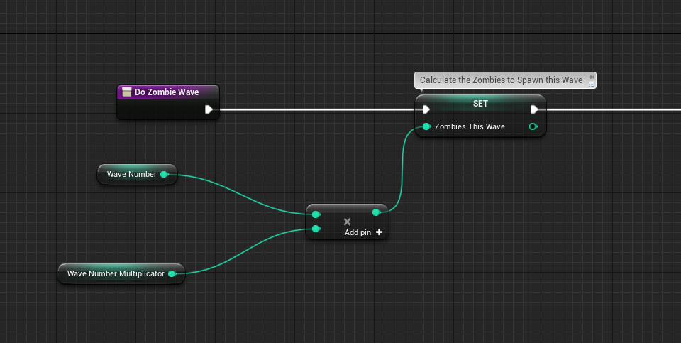

# Projektseite
[Zurück zur Hauptseite](https://github.com/Felixzed/Informatikprojekt)

# Einführung:

Hallo! Hier finden Sie meine Erklärung der Funktionsweisen meines Spiels. Als Grundlage habe ich ein Preset von Unreal Engine verwendet namens "FPPpreset" welches Bewegungsfunktionalität und First-Person-frameworks bereitstellt. Dieses habe ich stark bearbeitet und neue Funktionalitäten hinzugefügt, um meinen Spiel-Prototyp zu erstellen.

Gescriptet ist alles in "Blueprint", eine visuelle Programmiersprache, die mit sogenannten "Pins" arbeitet um Informationsübertragung darzustellen. Da ich im Bereich der 3D Modellierung wenig Erfahrung gesammelt habe verwende ich frei verfügbare Modelle aus vorhandenen Modellsammlungen. Diese sind am Ende der Dokumentation aufgelistet und können durch die Links aufgerufen werden.
Ich beanspruche die Erstellung dieser Modelle nicht als meine eigene Leistung.

## Glossar:

Actor: Jede Form von Objekt das ein Teil des Spielgeschehens ist. (Z.b. Spielercharakter, Wand, Kiste, Sound-Emitter, Schalter)

Pin: Ein In- und Output für Daten bei dem Programmieren mit Blueprints, z.B. ein Vektor, Array oder eine Objektreferenz.

Mesh: Das 3D-Form eines Actors ohne Textur. Z.B. ein Mensch, ein Stuhl, ein Tisch, eine Flasche oder eine Wand.

Tick: Ein "Tick" ist ein Arbeitsschritt in der Unreal Engine. Das Event "onTick" wird bei jedem Arbeitsschritt ausgeführt.
  
## Einführung Ausführungsreihenfolge:

Execution-Pins sind eine Visuelle Darstellung vom Scriptverlauf. Jede Funktion, z.B. "Launch Character", in Unreal Engine hat einen Execution-Pin Ein- und Ausgang. Blueprint-Scripte starten immer mit einem festen Start-Block, der verschiedene Events im Spielverlauf darstellt (OnHit, OnReceiveDamage). Diese Start-Blöcke haben nur einen Execution-Output, mit welchem normalerweise das Script eines Actors ausgelöst wird. Es ist möglich, eigene Events zu definierten. Im Rahmen dieses Projekts wurden neue Events erstellt.

Zusätzlich zu den beschriebenen Bluepriunts existiert eine Sonderform, sogenannte "Construction Scripts". Bei diesen gibt es einen Start-Block, der sich "OnConstruction" nennt. Construction scripts werden ausgeführt, sobald ein Objekt in einem level gespawnt wird (Construction - Aufbau, das Script wird sozusagen bei dem "Aufbau" eines Actors ausgelöst). Diese sind nützlich, um z.B. Actor anzugeben, die nach einer gewissen Zeit entfernt werden sollen.

Häufig werden für die Übersichtlichkeit Teile des Scripts in "Functions" aufgeteilt. "Functions" (Von hier an "Funktionen" genannt) generieren bei der Ausführung Events. Wenn eine Funktion mit den Namen "ShootProjectile" ausgeführt wird, gibt es dazu ein event, welches "Event ShootProjectile" heißt.

# Waffen-/Spielerfunktionalität Erklärt

## Funktion:
Der Spieler besitzt, um sich gegen die Zombies zu wehren, einen Granatenwerfer. Dieser kann kann mit der linken Maustaste abgeschossen werden.
Der Granatwerfer hat eine 6-Schuss Trommel und kann durch die R-Taste nachgeladen werden. Hierfür wird eine Munitionsreserve von max. 12 Granaten zugegriffen. Wenn die Reserve verbraucht wurde kann nicht weiter nachgeladen werden. Während dem Spiel muss Munition gesammelt werden, um den Vorrat aufzufüllen. Alle wichtigen Infos zu Munition (In der Waffe geladen/im Vorrat) werden unten Rechts auf dem Bildschirm angezeigt.
Wenn ein Spieler eine Munitionskiste berührt wird die Reservemunition vollkommen aufgefüllt.

### Bewegung:

Die tasten W/S und D/A wurden jeweils einer sogenannten "Input-Axis" zugewiesen. W/S wurde "MoveForward" zugewiesen und D/A "MoveRight". Dabei steht W bei MoveForward für 1 und S für -1, bei MoveRight D für 1 und A für -1. Diese Werte werden in dem Blueprint des Spielercharakters einer "AddMovementInput"-Funktion zugewiesen, welche diese Werte in Bewegungen umwandelt. Dieses Prinzip wird analog für die Sichtsteuerung mit der Maus angewandt.

### Schießen

Wenn der Spieler die linke Maustaste drückt prüft das Script, ob die verbleibende Munition größer als 0 ist oder ob der Boolean "IsReloading" false ist. Wenn keines des Events eintritt passiert nichts. Falls beide Events eintreten wird ein Granaten-Actor mit einer festen Geschwindigkeit in Blickrichtung der Kamera.

Um den Schussvektor zu definieren wird auf den Blickvektor ein Offset addiert. Somit entsteht der Eindruck, dass das Projektil nicht aus dem Zentrum des Bildschirms erscheint.

Abspielen vom Schussound und dem Mündungsfeuereffekt.

## Granaten:

Event: on EventHit
Ein hit-event wird generiert, wenn zwei Actor miteinander kollidieren.
Dieses hit-event löst einen execution-pin aus, welcher den Verlauf des Scripts beginnt.

Die Kollision wird zuerst deaktiviert, um keine weiteren HitEvents zu generieren. Darauf wird die ApplyRadialDamage Funktion ausgeführt.

Diese Funktion ermöglicht es, in einem Radius um einen Aufschlagspunkt Objekte zu "beschädigen".

Die UnrealEngine besitzt in dem bereits implementierten Gameplay-Framework ein Schadensmodul. Somit kann definiert werden, dass ein Actor beschädigt werden kann. 

Hierbei sind die Parameter für Base Damage, Minimum Damage, Origin, Damage Inner Radius, Damage Outer Radius, Damage Falloff, Damage Causer und Instigated by Controller relevant.

Base Damage beschreibt den Grundschaden, der in einem Radius verursacht wird. Minimum Damage definiert den Minimalwert, unter den der Schadenswert nicht fallen kann. Origin ist der Mittelpunkt des Radius und Damage Inner Radius. Dies beschreibt, ab welchem Punkt in einem Radius der maximale Schaden verursacht wird. Da der Origin nicht verschoben wird ein Wert von 0 eingesetzt. Damage Outer Radius beschreibt, ab welchem Punkt Schaden verursacht wird. Damage Falloff ist die Methode, welche zwischen den Werten von Minimum Damage und Base Damage milthilfe der Distanz zum Aufschlagspunkt und Outer Radius einen Schadenswert für einen Actor berechnet.

Apply Radial Damage benötigt die Information, welcher Actor nicht beschädigt werden soll.
Base Damage, Minimum Damage, Damage Inner Radius, Damage Outer Radius und damage Falloff sind Konstanten. Diese Werte werden im Verlauf der Anwendung nicht verändert. 

Auf dem Aufschlagspunkt wird eine Explosionseffekt erzeugt und der Actor für die Granate unsichtbar gesetzt.

Es folgt diese Sequenz in einem ForLoop:

Alle Objekte die von Granatenexplosionen weggestoßen werden sollen, werden mit dem Tag "PhysicsEnabled" gekennzeichnet.  
Im ersten Schritt wird mit "GetAllActorsWithTag" ein Array von Actor-Referenzen erstellt, welchen wir durch einen ForLoop führen.
Die For-Loop gibt von jedem Eintrag in einem Array die Parameter eines Actors in dem Array aus. Hiermit definieren wir im Grunde alle Actor die von AddRadialImpulse betroffen sein sollen. Mit GetComponentByClass wird der Datentyp "Object Reference" der in dem Array vorhanden ist zu einer "Primitive Component Reference" umgeformt. Dieser Datentyp wird von AddRadialImpulse benötigt.

AddRadialImpulse folgt dem Ablauf von "Loop Body", welcher für jeden Eintrag in einem Array ausgelöst wird. Der weitere Scriptverlauf folgt "Completed". "Completed" sendet ein Signal, sobald alle Einträge in dem Array verarbeitet wurden. 

ForLoop führt AddRadialImpulse aus.

AddRadialImpulse ermöglicht es, mit dem Granatwerfer PhysicsActor wegzustoßen.

"Target" Beschreibt, welches Objekt den Impuls erfahren soll.
"Origin" ist der Punkt, von dem der Radius ausgeht.
Die "Radius" und "Strength" pins sind float-values und beschreiben jeweils die Größe des Radius und Stärke des Impulses. Außerhalb des Radius wirkt der Impuls nicht. "Falloff" beschreibt, ob die Funktion, welche die abfallende Impulsstärke berechnet, exponentiell oder linear mit der Distanz vom Aufschlagspunkt abfällt. "Vel Change" definiert, ob der Impuls die Masse des weggestoßenen Objektes ignoriert.

Ein Visualisierung der beschriebenen Funktionalität:

Alle Actors, die von den Physik-Interaktionen der Granaten manipuliert werden können, sind mit einem "PhysicsEnabled"-Paramter gekennzeichnet. 

"Radius" und "Strength" sind als Konstanten definiert.

# Wellen- und Spawnstruktur

## Game Mode Blueprint
In dem "Game Mode Blueprint" werden die Wellenzahl, die Zombieanzahl und die Liste potentieller Spawnpunkte definiert und bearbeitet. Ebenfalls werden die UI-Elemente, z.B. der Countdown zur nächsten Welle, verarbeitet.

Die Game Mode Blueprint kann für jedes Level individuell ausgewählt und ausgeführt werden.

Hier eine Liste der Variablen, welche in dem Game Mode Blueprint gespeichert werden:

### Zufällige Spawnpunkte
Alle Actor, welche den Tag "ZombieSpawnPoint" besitzen, liefern beim Start der Anwendung die aktuelle Position in einen Array "SpawnList". Dies wird im Blueprint des Spielmodus gespeichert. Von diesem Array wird zufällig ein Eintrag ausgewählt, wenn ein Spawnzyklus ausgeführt wird und als Spawnort für den Zombie eingespeist. Somit werden in jedem Spawnzyklus zufällig gespawnte Zombies zu dem Level hinzugefügt.

Dieses Script wird bei "EventBeginPlay" ausgeführt. Das Event wird bei jedem Starten eines Levels ausgeführt.

## Wellen-Spawning

Die Wellengröße wird berrechnet aus der Wellenzahl und dem Schwierigkeitsmultiplikator, dieser wert wird dann als Endwert in einen ForLoop geführt.

Der ForLoop führt den Loop Body von 1 bis zum Wert von ZombiesThisWave aus, hierbei wird ein zufälliger Eintrag der Spawnpunktliste ausgewählt und damit ein Zombie mit KI gespawnt. 

# Zombies, Schaden und KI.

## Zombies

## Funktionen

Zombies erscheinen je nach Wellenzahl in immer größeren Mengen, sie erscheinen in ihren korrospondierenden Mengen an zufälligen vordefinierten Punkten, sogenannten "ZombieSpawnPoints" und bewegen sich immer zum Spieler, auch wenn sie ihn nicht sehen können. Sobald sie nah genug an dem Spieler sind, werden sie versuchen ihn anzugreifen. Der Spieler kann Zombies mit seinem granatwerfer bekämpfen, sie sterben nachdem sie 100 Punkte Schaden erlitten haben. Wenn Zombies sterben können sie potentiell Munitionskisten droppen und werden zu ragdolls und später dann gelöscht.

## Schaden nehmen
Zombies erleiden Umgebungsschaden, wenn eine Granate des Spielers in der Nähe explodiert.

Diese Funktion ist in der Unterfunktion "ZombieDamageHandler" definiert.
Jeder Zombie besitzt für dieses System zwei Variablen: "MaxHealth" und "CurrentHealth".
MaxHealth ein konstanter Wert von 100, diese Konstante definiert die maximalen Lebenspunkte eines Zombies. CurrentHealth  speichert die aktuell verbleibenden Lebenspunkte.

Der Spieler verursacht Radial Damage. Bei einem Treffer wird die Funktion ZombieDamageHandler mit einem Event On Take Radial Damage aufgerufen.
CurrentHealth des getroffenen Zombies wird abgerufen. Von diesem Wert wird der erlittenen Schaden subtrahiert, das Ergebnis ist der neue Wert für CurrentHealth.
Abhängig von dem neuen Wert für CurrentHealth wird ein Boolean erzugeugt. Dieser gibt an, ob der Wert kleiner 1 ist. Wenn weniger als 1 Lebenspunkt verbleibt wird der Zombie entfernt und ein Ragdoll erzeugt.

### Ragdolling
Ragdolling ist ein Feature, welches die Meshes der Zombies mit simulierter Physik zusammenfallen lässt. (Rag doll = Stoffpuppe)
Diese Funktion ist den verwendeten PhysicsActors ähnlich. Die Zombie Meshes erhalten, sobald ihr übergeordneter actor unter 100 Health fällt, den Tag "PhysicsEnabled". Die Physiksimulation wird für den Mesh aktiviert und die Sichtbarkeit und Kollision der Capsule Component deaktiviert. Diese werden 5 Sekunden später gelöscht, somit werden die Meshes aus dem Level entfernt.

## Zombie KI
Zombies besitzen als Verhaltensmuster die Aktionen Bewegen und Angreifen. 

OnTick erhält jeder Zombie den Befehl, sich zu der Spielerposition zu bewegen. 

Um den Zombie wird abhängig von "AcceptanceRadius" ein Radius berechnet. Wenn der Spieler sich in diesem Radius befindet wird ein "OnSuccess"-Pin ausgeführt. Wenn der Spieler nicht in diesem Radius steht wird ein "OnFailure"-Pin ausgeführt. OnSuccess und OnFailure setzen hierbei eine Boolean-Variable "IsAttacking" auf wahr oder falsch. IsAttacking wird für die Angriffsanimation genutzt.

## Zombie-Nahkampfangriffe
Nach einem Gate welches unser Script nur ausführt wenn IsAttacking wahr ist, wird es in eine Verzögerung geleitet. Nach der Verzögerung wird geprüft, ob der Spieler sich mehr als 40 Unreal Engine Distanzeinheiten (1UE = 1cm) von dem Zombie entfernt hat, wenn er dies getan hat wird der Angriff zwecks Branch mit Boolean abgebrochen. Wenn er dies nicht getan hat wird Schaden ausgeteilt. Dies erlaubt dem Spieler von dem Angriff des Zombies wegzulaufen bevor er davon getroffen wird, obwohl er sich vorher schon im Angriffsradius befand.

## Munition Fallen Lassen
Jeder Zombie besitzt eine fest definierte Chance, eine Munitionskiste zu fallen zu lassen. Die Wahrscheinlichkeit, ob eine Munitionskiste fallen gelassen wird, kann durch eine Zufallsfunktion bestimmt werden. Hierfür wird ein float-Wert zwischen 0 und 1 generiert. Wenn der generierte Wert kleiner dem Wert der Variable "AmmoCrateDropChance" wird eine Munitionskiste erstellt.

 Munitionskisten sind Physikobjekte. Wenn der Spieler in eine Munitionskiste läuft wird die Reservemunition des Spielers aufgefüllt und die Kiste aus dem Spiel Entfernt. Diese Funktion wird durch das OnBeginOverlap-Event ausgelöst.

 
 
 
# Animationen u. Effekte

## Animation von Spieler, Zombies
Sowohl der Spieler als auch die Zombies besitzen ein sogenanntes "Animation-Blueprint". Dies ermöglicht es, jegliche Animationen an einer Mesh darzustellen.
Hierzu besitzt die Animation Blueprint von dem Zombie eine sogenannte "State Machine". Diese berechnet anhand von verschiedenen Booleans flüssige Animationsübergänge von verschiedenen "Stadien" in der Animation des Zombies. Ein solcher Übergang findet z.B. zwischen der Animation für das Laufen und Angreifen statt.

Hier das Beispiel der State Machine des Zombie-Modells:

"Standing/Movement" ist die Animation die gespielt wird während der Zombie nicht angreift, "Attacking" ist die Animation die gespielt wird, wenn die Variable "IsAttacking" True ist.
Der Übergang von Standing/Movement zu Attacking erfordert, dass "IsAttacking" True ist. Der Übergang von Attacking zu Standing/Movement erfordert, dass "IsAttacking" False ist.

Hier ein Einblick in den übergang von Standing/Movement zu Attacking:

Standing/Movement ist ein "Animation Blend". Ein Verbund zweier Animationen der anhand von einem Float von der einen Animation zu der anderen flüssig übergeht.

