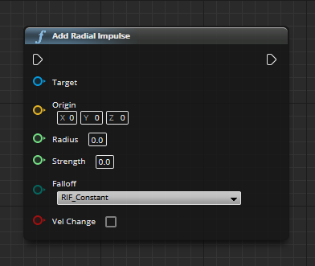

# Stundenbericht Informatikprojekt

[Zurück zur Hauptseite](https://github.com/Felixzed/Informatikprojekt)

### Notiz:
Stundenlog sollte beschreiben, was man in einer Stunde (Oder auch Schulstunde) Arbeit am Projekt erreicht hast.

## Erste Stunde: 45 min.
Einführung in Organisatorisches, keine Arbeit am Projekt.

## Zweite Stunde: 45 min.
Arbeit an dem Projekt-Github, Arbeit an Projektwichtigen Dateien wie z.B. Stundenbericht und Readme

## Heimarbeit: 2 Stunden
Projekt erstellt.
Features: First-Person Character der Schießen, Springen und sich bewegen kann.
Brainstorming an dem Minimal Viable Product (MVP)

Erstellung Trello: https://trello.com/b/FDvxKhjR/informatikprojekt-2020

## Dritte stunde: 45 min.
Weitere Arbeit an der GitHub repository.

Erstellung Design Doc: https://docs.google.com/document/d/1RfED8MwGAkDmg-AF9oWtLQ55LMtbvNNZ1ETjN1LYYiw/edit

## Vierte Stunde: 45 min. 
Arbeit an potentieller Angehensweise für Munition, Schussfunktion und Explosionsmechaniken.

## Fünfte Stunde: 45 min.
Nachforschen von Blueprint-Programmierung, Arbeit an Organisationsprogrammen.

## Sechste Stunde: 45 min.
Weiteres Forschen an Blueprint.

## Heimarbeit: 3 Stunden
Neu: Granatwerfer Schussfunktionalität - Waffe Schießt explodierende Projektile, die andere PhysicsActors vom Aufschlagpunkt wegstößt.

Neu: Test-Map

Neu: Ragdoll-Charactere, die korrekt von Impulsen weggestoßen werden.

### Besondere Schwierigkeiten:

Add Radial Impulse war hier schwieriger zu verstehen, da ich in einem Radius PhysicsActor von dem "Origin" (Sprich; dem Aufschlagspunkt) ausgehend wegstoßen wollte, die "Target" Node hier Definiert nicht allerdings wie vorher angenommen die 3D-Form die der Radius annimmt (z.B. Würfel, Sphere), sondern eher beschreibt es **welcher** PhysicsActor von dem Origin ausgehend in einem Radius weggestoßen werden soll. Nun musste ich einen Weg herausfinden, jedes Objekt das potentiell Weggestoßen werden konnte in diesem einen "Target" Pin anzugeben.

Gelöst habe ich dies mit einem "For" loop:

Der ForLoop war hier perfekt, ich habe einfach jedem Objekt das Physik simuliert einen Tag gegeben, der sich "PhysicsEnabled" nennt. Nun erstellen wir eine "GetActorsWithTag" node, die alle Actors mit dem Tag "PhysicsEnabled" ausgibt und lassen den ausgegebenen Array in den ForLoop laufen, welcher nun für jeden Eintrag in dem Array einmal "Loop Body" ausführt und sobald er fertig ist "Completed" ausgibt.

### Meine Lösung sieht dann so aus:

*Hier noch ein Bild einfügen*

## Siebte Stunde: 45 min.
Arbeit am Stundenbericht

## Heimarbeit: 40 min.
Erste Bugs wurden entdeckt!
Ich hatte den ExecutionOrder Pin "Loop Body" des ForLoop für den Rest des Programms laufen lassen.
Somit hatte sich das Projektil versucht x-mal zu löschen und hat x-mal sich nicht richtig löschende Explosionseffekte generiert. Sehr performance-intensiv.
Ich habe nun einen kleines Programm in den Actor des Explosionseffektes eingesetzt, damit dieser sich nach seinem Erstellen nach 3 sekunden löscht. Dazu habe ich noch den Rest des Programmes nach dem "Completed" Pin des ForLoop laufen lassen, dahinter kam noch ein "DoOnce" Befehl, nur um sicher zu sein.

### Meine verbesserte Lösung:
*Hier noch ein Bild einfügen*

## Achte Stunde: 45 min.
Arbeit am Stundenbericht, Arbeit an Projektseite.

## Neunte Stunde: 45 min.
Kurze Arbeit am Stundenbericht (Erklärung von Characterfunktionalität), Arbeit an Projektseite.

## Zehnte Stunde: 45 min.
Kurze Arbeit am Stundenbericht (Erklärung von Granatenfunktionalität), Arbeit an Projektseite.

## Elfte Stunde: 45 min.
Nachforschung rund um Schadenssysteme, Nachforschung zur KI-Implementierung, Nachforschung zu Projektilverhalten.

## Zwölfte Stunde: 45 min.
Arbeit an der Projektseite: Einführung und Glossar verbessert.

## Heimarbeit: 2 Stunden

Neu: Health-System für Zombies

Neu: Zombie-NPC, die den Spieler angreifen und als Ragdoll umfallen, sobald sie 100 Punkte Schaden nehmen.

Schwierig war hier die Physik für die Ragdolls zum funktionieren zu bringen, ich musste der Mesh des Charakters den Tag "PhysicsEnabled" zuweisen, damit diese von der Explosion der Granaten weggeschoben wird, hierfür musste ich einen Array von Strings des Actors aufrufen und zu diesem einen weiteren Entry mit PhysicsEnabled geben, danach wird der Array abgespeichert und der Ragdoll funktioniert!
Schadensfunktionalität hatte ich sowieso bereits in die Granaten eingebaut, also gab es da keine Probleme. Ich habe dann zwei Variablen erstellt, einmal "MaxHealth" und "CurrentHealth" und mit jedem Schadens-Event wurde CurrentHealth mit dem Schadenswert abgezogen.

## Heimarbeit: 5 Stunden

Weitere Arbeit an Grundmechaniken des Spiels

Neu: Nachlade-Funktionalität für Waffe

Neu: Hintergrundgeräusche

Neu: Zombie-KI und Schaden

Neu: Spieler-HUD

Neu: Animations-framework für Zombies

Neu: Zombie-Zufallsspawnen

Schwierigkeiten kamen hier u.a. auf bei dem Animations-Framework, ich wusste nicht genau wie ich einer Mesh, also dem Modell des Zombies, die animationen zuweisen sollte. Später lernte ich dann über eine Funktion der Unreal Engine genannt "Animation Blends". Diese Blends können anhand von einer Float-Variable flüssige Übergänge zwischen Animationen bilden, diese verwende ich z.B. um einen Übergang von Stehen zum Laufen bei den Zombies. Auch habe ich über sogenannte "Behaviour trees" gelernt, die es mir erlauben einen flüssigen Übergang anhand einer Boolean zwischen meiner Lauf/Steh-Blend und meiner Angriffsanimation zu erstellen.

Auch das Spawnen war schwierig, ursprünglich hatte ich mit einem WhileLoop gearbeitet der, sobald die zu spawnende Menge zombies gespawnt war, aufhört. Dies hatte ich dann mit einem ForLoop der bei 0 anfing und abhängig von der Anzahl der Zombies der diese welle gespawnt werden sollte war. Eigenartig war das verhalten, dass wenn ich die Anzahl der Zombies für die Welle auf 10 stellte, immer 5 spawnten, wenn ich sie auf 7 stellte, spawnten immer 4. Grund hierfür, ich hatte aus versehen pro loop die Anzahl an zu spawnenden Zombies doppelt dekrementiert da ich vergessen habe diesen Teil aus der ursprünglichen WhileLoop-Implementation zu löschen. Nachdem ich dies behoben hatte standen die gespawnten Zombies allerdings einfach nur herum, sie konnten Schaden nehmen etc. aber angriffsanimationen spielen oder sich bewegen taten sie nicht. Grund hierfür war, dass ich den Actor ohne KI in die Welt platziert habe, hierfür habe ich die Funktion "SpawnActor" einfach mit "SpawnAiActor" ersetzt, daraufhin besaßen sie wieder volle Funktionalität.

## 13te Stunde: 45 min.
Arbeit erläuterung Spawnfunktionalität in sowohl Projektseite als auch Stundenbericht.

## Heimarbeit: 6 Stunden.

Neu: Neues Waffenmodell

Neu: Granateneffekte überarbeitet

Neu: Wellenmodus

Es gab erstaunlicherweise wenig Schwierigkeiten hierbei, ich hatte mir bei dem neuen Waffenmodell ein Modell ohne Textur ausgesucht. Ich hatte dann Blender verwendet und gelernt wie man etwas mit texturen verseht, das passierte dann auch relativ schnell. 

Mit dem Wellenmodus gab es auch wenig Probleme, ich habe die geplante ausführung Problemlos durchsetzen können.

## Heimarbeit: 4 Stunden.

Neu: Hauptmenü

## 14te Stunde: 45 min.
Erfolgreiche Installation des Unreal-Editors auf den Schulcomputern im CR2.

## 15te Stunde: 45 min.
Demonstration an Herr Buhl, Cleanup mancher Scripts im Projekt.

## 16te Stunde: 45 min.
Arbeit an dem Projekt in CR2, Kommentierung von Scripts und mehr Cleanup.

## 17te Stunde: 45 min.
Arbeit an dem Projekt in CR2, Kommentierung von Scripts.

## 18te Stunde: 45 min.
Versuch Installation von UE4 auf Lehrercomputer in CR1.

## 19te Stunde: 45 min.
Erfolgreiche Installation von UE4 auf Lehrercomputer, Arbeit an Projektseite u. Stundenbericht.

